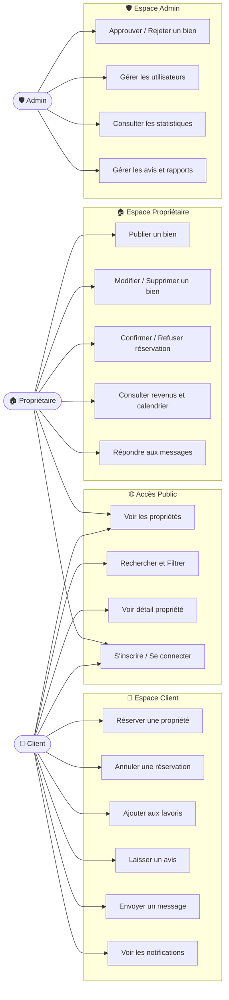
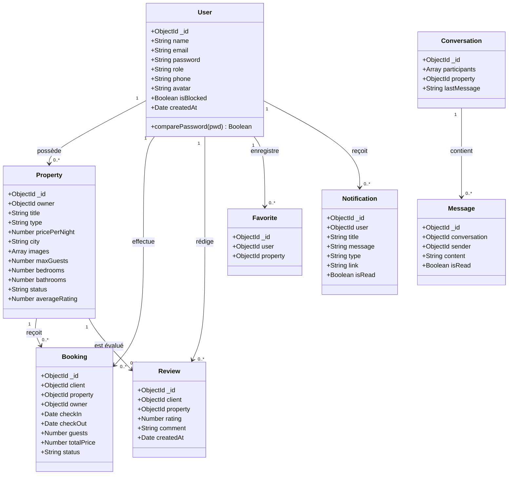
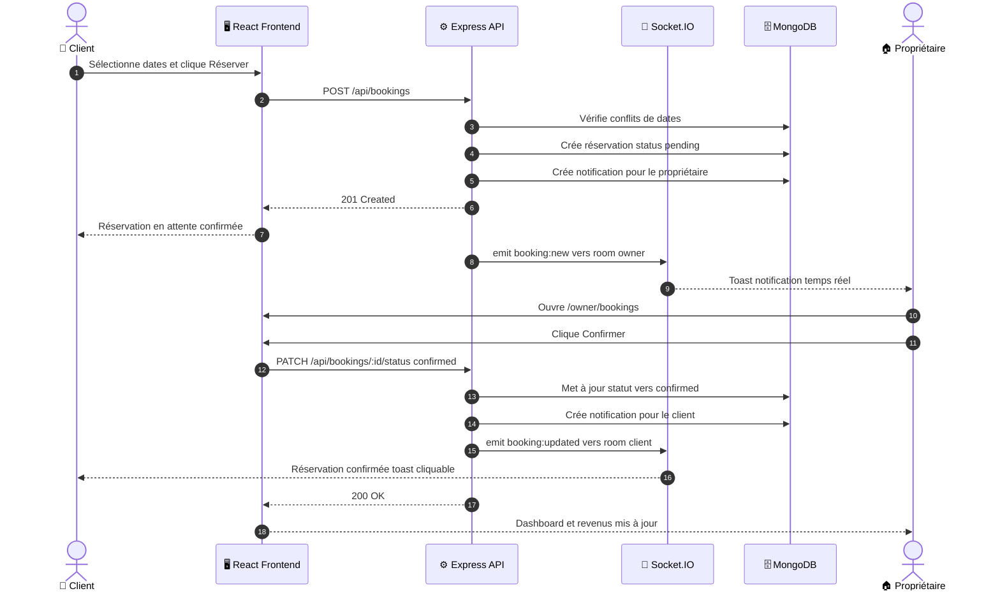
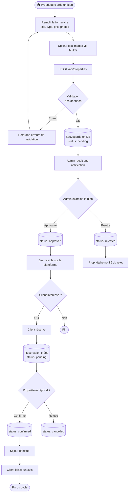

# 🏡 ReserverDark — Plateforme de Location Courte Durée au Maroc

<div align="center">


**Une application web moderne, performante et complète pour la réservation et la gestion de biens immobiliers (Riads, Villas, Appartements) au Maroc.**

[Fonctionnalités](#-fonctionnalités-principales) • [Architecture & Diagrammes](#-architecture--diagrammes) • [Installation](#-installation--démarrage) • [API Documentation](#-endpoints-api) • [Structure](#-structure-du-projet)

</div>

---

## 🌟 Aperçu du Projet

**ReserverDark** est une plateforme SaaS immobilière bilingue (Français, Anglais, Arabe) dédiée au marché marocain. Elle met en relation directe les voyageurs cherchant un séjour authentique et les propriétaires de biens d'exception (Casablanca, Marrakech, Tanger, Rabat, Agadir, Fès...).

### 🎯 3 Eaux de travail distincts (RBAC) :
1. **Voyageur (Client)** : Découverte, recherche avancée, réservation en ligne, messagerie en direct, favoris et avis.
2. **Propriétaire (Hôte)** : Tableau de bord financier, publication et gestion de logements, gestion des réservations (confirmation/rejet), calendrier des disponibilités et suivi des revenus.
3. **Administrateur** : Modération des annonces, gestion des utilisateurs et propriétaires, statistiques globales et supervision de la plateforme.

---

## 📊 Architecture & Diagrammes

### 1. 👥 Diagramme de Cas d'Utilisation (Use Case)



---

### 2. 🗂️ Diagramme de Classes (Class Diagram)



---

### 3. 🔄 Diagramme de Séquence — Flux de Réservation



---

### 4. 🔁 Diagramme d'Activité — Cycle de vie d'une Propriété



---
## ✨ Fonctionnalités Principales

### 🎨 Design & Expérience Utilisateur
- **Design Moderne & Épuré** : Palette Bleue Royale (`#2563EB`), cartes arrondies (`rounded-2xl`), ombrages fluides et typographie élégante.
- **Mode Sombre & Mode Clair** : Basculement automatique ou manuel avec conservation des préférences utilisateur.
- **Internationalisation (i18n)** : Prise en charge native du Français 🇫🇷, Anglais 🇬🇧 et Arabe 🇲🇦.
- **Responsive Mobile First** : Conçu pour une utilisation sur Smartphone, Tablette et Ordinateur de bureau.

### 🏠 Espace Propriétaire Complet
- **Tableau de bord** : Vue globale sur les KPIs (biens actifs, réservations, gains).
- **Mes logements** : Filtrage par statut (`Validé`, `En attente`, `Rejeté`), recherche instantanée et suppression sécurisée.
- **Ajout & Édition de logement** : Formulaire multi-champs (type, ville marocaine, commodités avec checkboxes, photos prévisualisées).
- **Gestion des réservations** : Validation ou refus des demandes en 1 clic.
- **Calendrier interactif** : Vue par mois avec repérage des dates occupées et modal des détails par jour.
- **Suivi des revenus** : Graphique mensuel des gains en MAD, ventilation par logement et historique comptable des paiements.

---

## 🛠️ Stack Technique

| Domaine | Technologies |
|---|---|
| **Frontend** | React 19, Vite, Tailwind CSS, React Router v7, Lucide Icons, Date-fns, Axios, React Hot Toast, i18next |
| **Backend** | Node.js, Express.js, JWT (JSON Web Tokens), Bcryptjs, Express-rate-limit, Helmet, CORS |
| **Base de données** | MongoDB Atlas, Mongoose ODM |
| **Médias & Upload** | Cloudinary API, Multer |
| **Temps Réel** | Socket.IO |

---

## 🚀 Installation & Démarrage

### 1. Prérequis
- [Node.js](https://nodejs.org/) (version 18 ou supérieure)
- [MongoDB](https://www.mongodb.com/) (local ou cluster MongoDB Atlas)
- Git

### 2. Cloner le projet
```bash
git clone https://github.com/Houssamar-hub/ReserverDark.git
cd ReserverDark
```

### 3. Configuration du Backend (`/server`)
```bash
cd server
npm install
```

Créez un fichier `.env` dans le dossier `server/` :
```env
PORT=5000
NODE_ENV=development
MONGO_URI=mongodb://localhost:27017/reserverdark
JWT_SECRET=votre_cle_secrete_jwt_tres_longue_et_securisee
JWT_EXPIRE=30d

# Cloudinary (optionnel pour upload réel)
CLOUDINARY_CLOUD_NAME=votre_cloud_name
CLOUDINARY_API_KEY=votre_api_key
CLOUDINARY_API_SECRET=votre_api_secret
```

Lancer le serveur :
```bash
npm run dev
```

### 4. Configuration du Frontend (`/client`)
Dans un nouveau terminal :
```bash
cd client
npm install
```

Créez un fichier `.env` dans le dossier `client/` :
```env
VITE_API_URL=http://localhost:5000/api
VITE_SOCKET_URL=http://localhost:5000
```

Lancer le client Vite :
```bash
npm run dev
```
L'application est disponible sur : **`http://localhost:5173`**

---

## 📡 Endpoints API

### 🔐 Authentification (`/api/auth`)
- `POST /api/auth/register` — Inscription (rôle: client ou owner)
- `POST /api/auth/login` — Connexion & génération du token JWT
- `GET /api/auth/me` — Récupérer les informations de l'utilisateur connecté

### 🏠 Logements (`/api/properties`)
- `GET /api/properties` — Liste des logements validés (filtres: ville, prix, type, commodités)
- `GET /api/properties/:id` — Détail d'un logement
- `GET /api/properties/owner/my` — *(Protégé Owner)* Liste des logements de l'hôte
- `POST /api/properties` — *(Protégé Owner)* Créer un nouveau logement
- `PUT /api/properties/:id` — *(Protégé Owner)* Modifier un logement
- `DELETE /api/properties/:id` — *(Protégé Owner)* Supprimer un logement

### 📅 Réservations (`/api/bookings`)
- `POST /api/bookings` — *(Protégé Client)* Créer une demande de réservation
- `GET /api/bookings/my` — *(Protégé Client)* Historique des réservations du voyageur
- `GET /api/bookings/owner` — *(Protégé Owner)* Réservations reçues par l'hôte
- `GET /api/bookings/stats` — *(Protégé Owner)* Statistiques financières et globales
- `PATCH /api/bookings/:id/status` — *(Protégé Owner)* Confirmer (`confirmed`) ou Rejeter (`rejected`)

---

## 📁 Structure du Projet

```text
ReserverDark/
├── client/                      # Application Frontend React 19 + Vite
│   ├── public/                  # Assets statiques (icônes, images de fallback)
│   ├── src/
│   │   ├── components/          # Composants réutilisables
│   │   │   ├── common/          # Button, Modal, Spinner, Input
│   │   │   ├── layout/          # Navbar, Footer, Sidebar
│   │   │   └── property/        # PropertyCard, PropertyFilters
│   │   ├── context/             # AuthContext, ThemeContext, NotificationContext
│   │   ├── i18n/                # Configurations et traductions (FR, EN, AR)
│   │   ├── pages/               # Pages organisées par rôle
│   │   │   ├── admin/           # Dashboard Admin, Users, Reports
│   │   │   ├── auth/            # Login, Register, ForgotPassword
│   │   │   ├── client/          # Client Dashboard, Bookings, Favorites, Messages
│   │   │   ├── owner/           # Dashboard, MyProperties, Add/Edit, Calendar, Revenue
│   │   │   └── public/          # Home, Properties, Details, About, Contact
│   │   ├── routes/              # AppRoutes, ProtectedRoute
│   │   ├── services/            # Client API Axios configuré
│   │   └── utils/               # formatPrice, formatDate, helpers
│   └── index.html
│
├── server/                      # Application Backend Node.js + Express
│   ├── config/                  # Connexion DB (MongoDB), Cloudinary
│   ├── controllers/             # Logique métier (Auth, Property, Booking, User)
│   ├── middleware/              # AuthMiddleware, RoleMiddleware, UploadMiddleware
│   ├── models/                  # Schémas Mongoose (User, Property, Booking, Review)
│   ├── routes/                  # Définitions des routes Express
│   ├── sockets/                 # Gestion des événements Socket.IO temps réel
│   ├── app.js                   # Configuration Express
│   └── server.js                # Point d'entrée HTTP & WebSocket
│
└── README.md                    # Documentation complète du projet
```

---

## 📄 Licence & Droits

Développé pour **ReserverDark** © 2026. Tous droits réservés.
